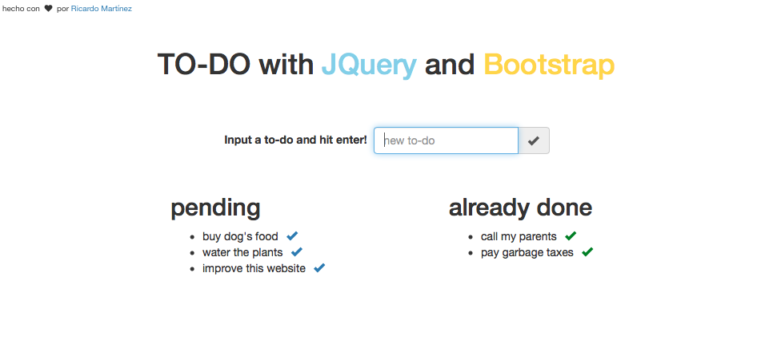

## Full Stack Web Development Bootcamp @Otoño2017

### Otro TO-DO más... con JQuery, Bootstrap y Sass.

Pequeño ejemplo de integración entre JQuery y Bootstrap.

 + [to-do website](https://mtzfactory.github.io/jquery-challenge/)

